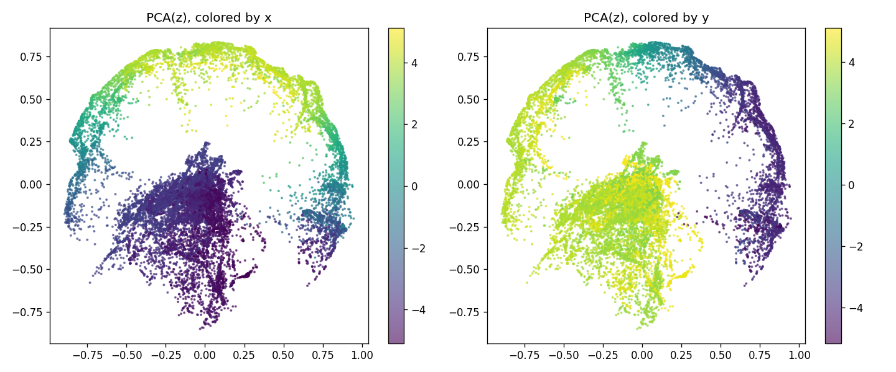
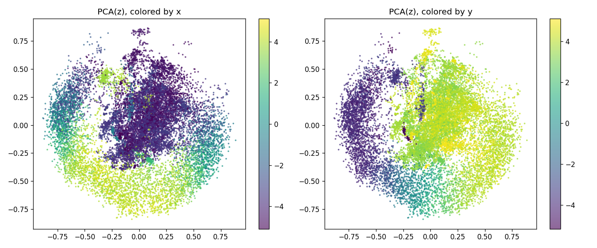

# Encoder runs: side-by-side

| Metric | xy2d | full29d |
|---|---|---|
| Encoder input | xy | full |
| Steps | 200000 | 200000 |
| Wall time (min) | 62.1559 | 65.4741 |
| Val InfoNCE loss | 3.3016 | 2.8061 |
| Val top-1 acc | 0.2535 | 0.3324 |
| Val top-5 acc | 0.5945 | 0.7109 |
| Val forward MSE | 0.0018 | 0.0029 |
| Val inverse MSE | 0.2537 | 0.0849 |
| z->xy probe R^2 | 0.1645 | 0.0761 |
| Temporal Spearman | 0.5029 | 0.5285 |

## PCA scatter

### xy2d (input=xy)

### full29d (input=full)

